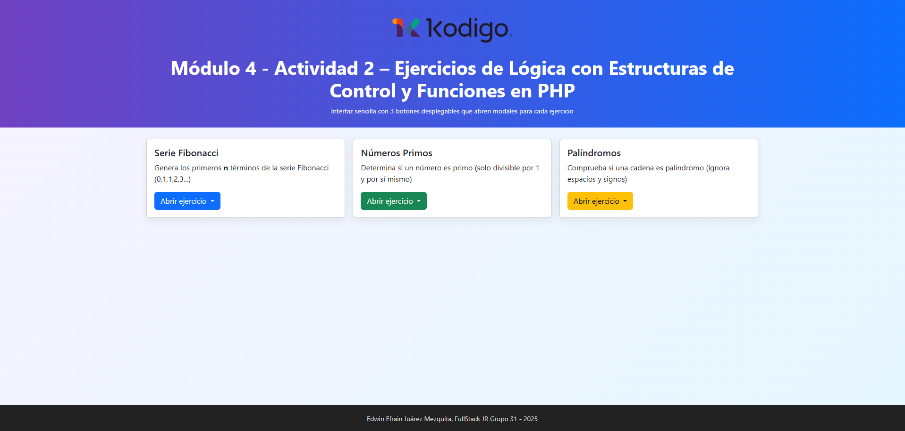

# Módulo 4 - Actividad 2 – Ejercicios de Lógica con Estructuras de Control y Funciones en PHP

Este proyecto contiene 3 ejercicios básicos de lógica implementados en PHP, con un diseño sencillo usando **Bootstrap** y modales para la interacción:

1. **Serie Fibonacci** → Genera los primeros `n` términos.
2. **Números Primos** → Determina si un número es primo o no.
3. **Palíndromos** → Verifica si una cadena es palíndroma.

---

## 🛠️ Requisitos
- Tener instalado [XAMPP](https://www.apachefriends.org/es/index.html) (para Apache y PHP).
- Colocar los archivos en la carpeta `htdocs`.

---

## ▶️ Ejecución
1. Copiar el proyecto dentro de `C:\xampp\htdocs\modulo4-actividad2`.
2. Iniciar **Apache** desde el panel de XAMPP.
3. Abrir en el navegador: http://localhost/modulo4-actividad2/

## 🖼 Vista previa

## Ejercicio 1

## Ejercicio 2

## Ejercicio 3

---
## ✒️ Autor
Edwin Efraín Juárez Mezquita  
FullStack JR – Grupo 31 – 2025
