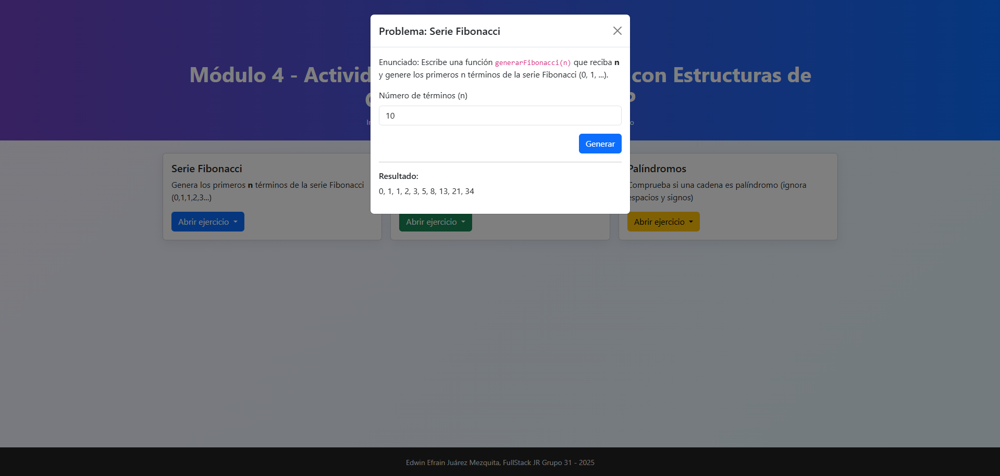
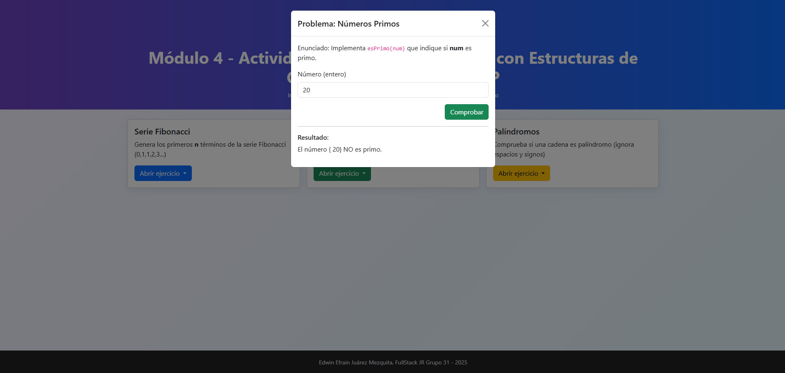
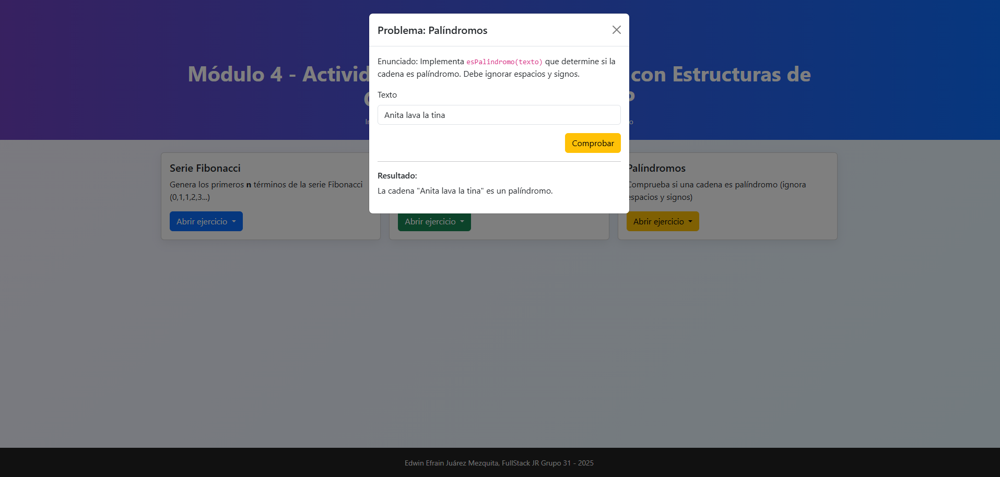
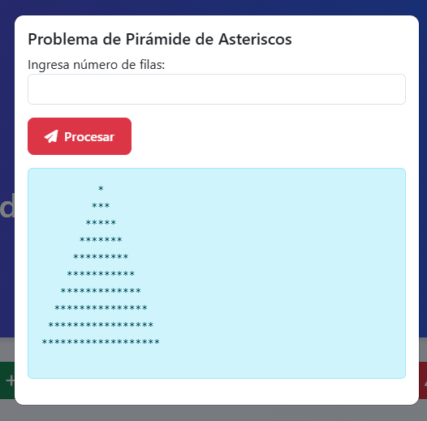
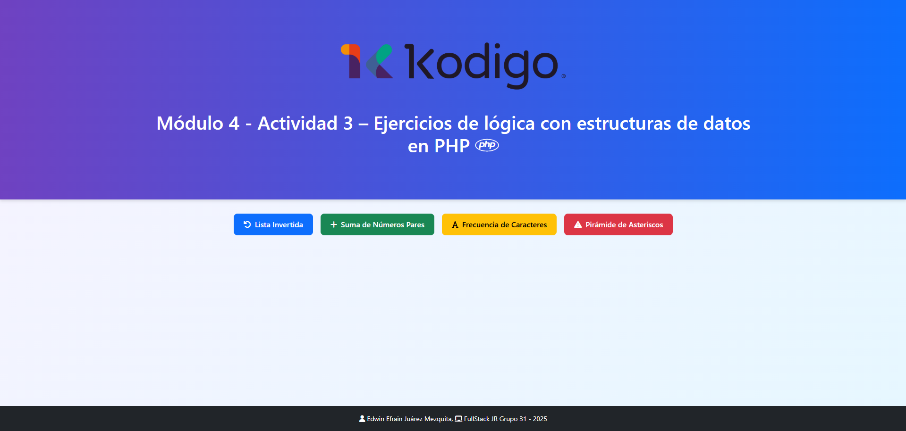

# Módulo 4 - Actividad 3 – Ejercicios de Lógica en PHP

Este proyecto resuelve 4 problemas de lógica en PHP utilizando **estructuras de control, funciones y estructuras de datos**.  
La interfaz está desarrollada con **Bootstrap 5**, **FontAwesome** para íconos y estilos propios en `styles.css`.

---

## 🧩 Ejercicios Implementados

1. **Lista Invertida**  
   Toma un array de números y devuelve sus elementos en orden inverso.
     

2. **Suma de Números Pares**  
   Suma todos los números pares de un array de enteros.  
   

3. **Frecuencia de Caracteres**  
   Devuelve un array asociativo con la frecuencia de cada carácter de una cadena. 
     

4. **Pirámide de Asteriscos**  
   Genera un patrón de asteriscos en forma de pirámide utilizando bucles anidados.  
   

---

## 🖼 Capturas del proyecto

---

## 🚀 Ejecución

1. Coloca la carpeta `LogicaPHP` dentro de `C:\xampp\htdocs\`.
2. Asegúrate de que **Apache** esté corriendo en XAMPP.
3. En tu navegador abre:  
   👉 [http://localhost/LogicaPHP](http://localhost/LogicaPHP/)

---

## 👨‍💻 Autor

Edwin Efraín Juárez Mezquita  
*FullStack JR Grupo 31 - 2025*